***Primeiro Passo***

inicializar o virtual box
    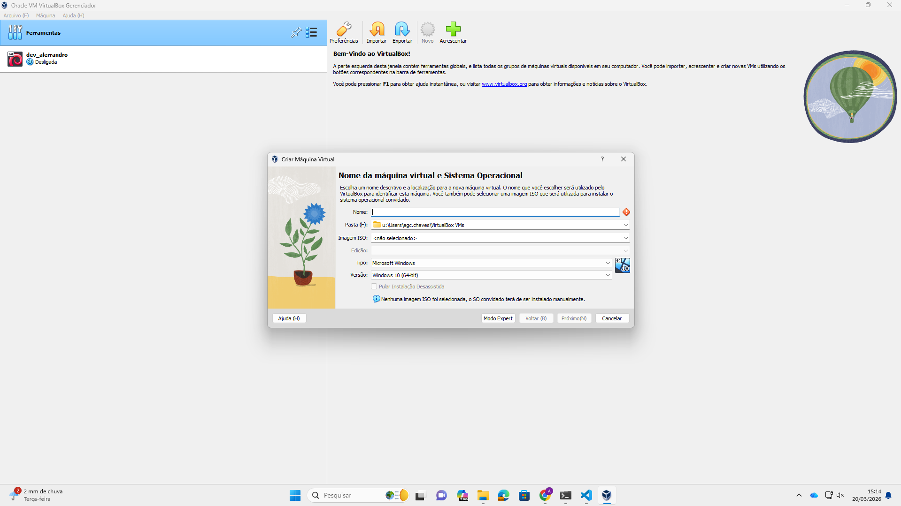

## foto 2 

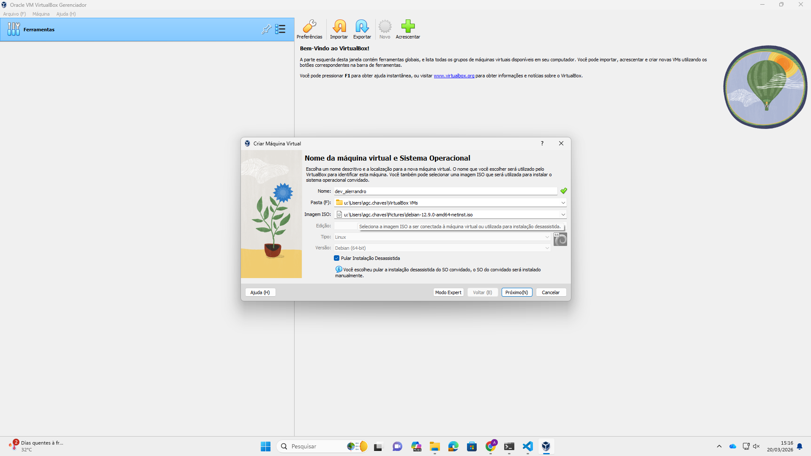

## foto 3

## foto 4 

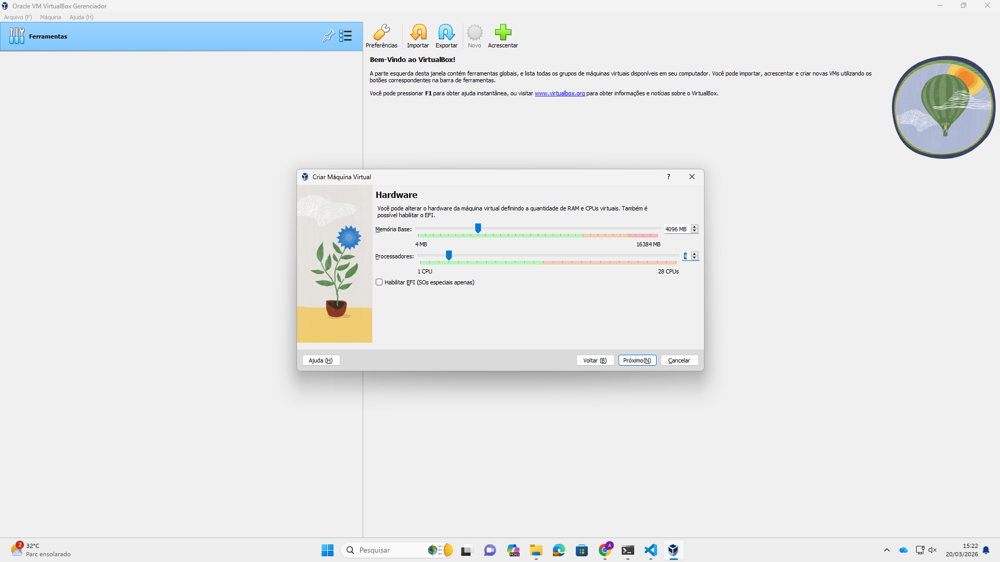

## foto 5

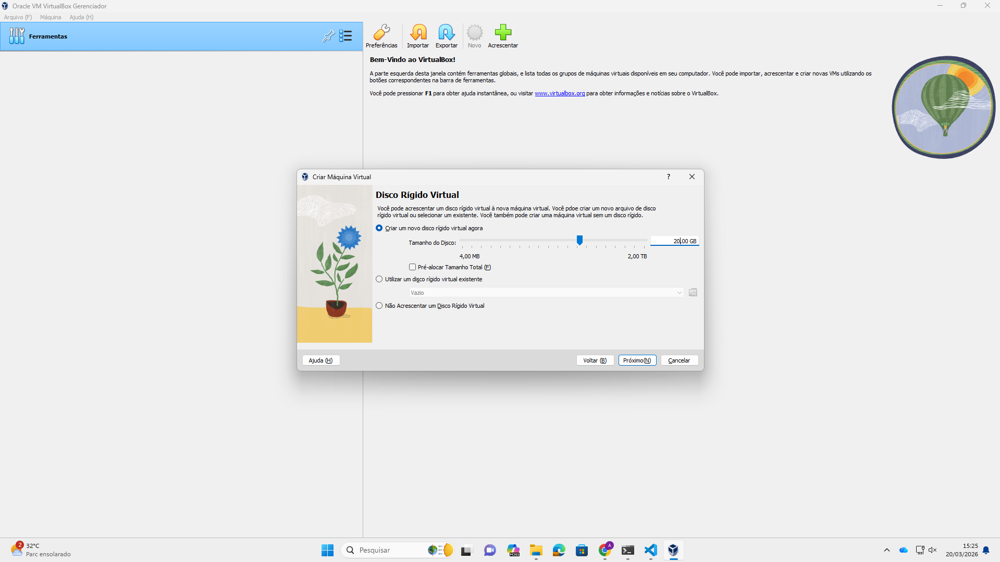

## foto 6

## foto 7

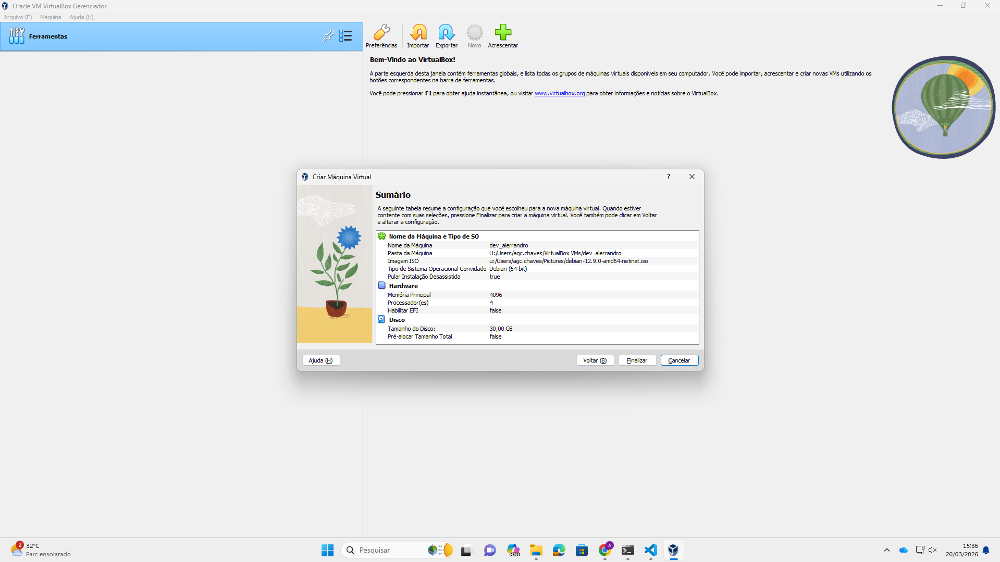

## foto 8

## foto 9

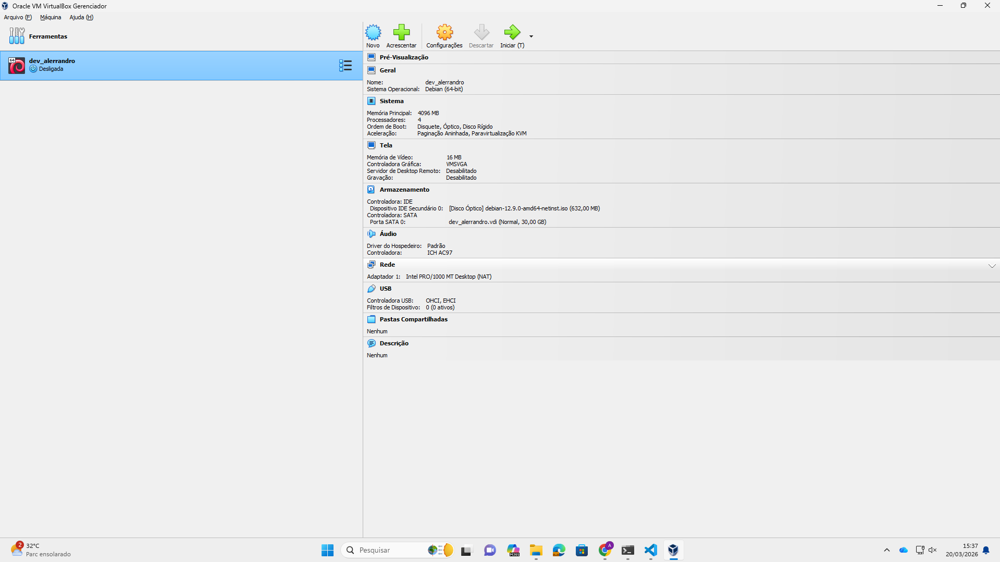

## foto10

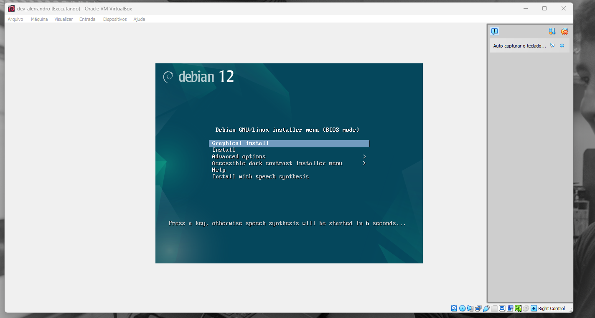

## foto 11

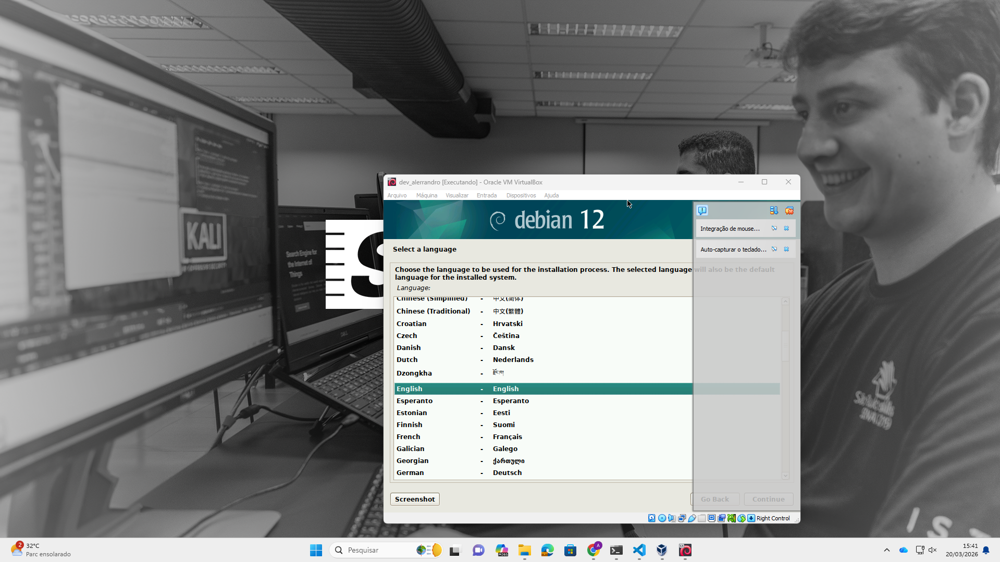

## foto 12

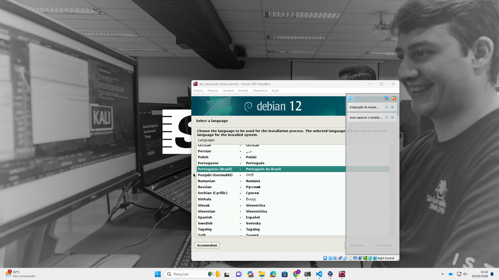

## foto 13

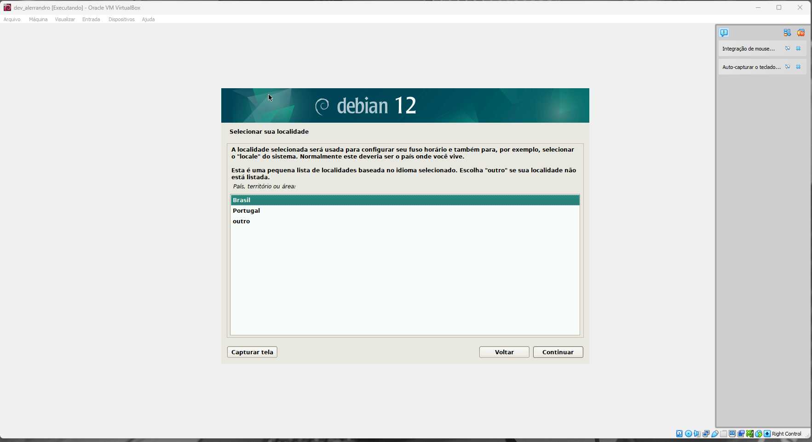

## foto 14

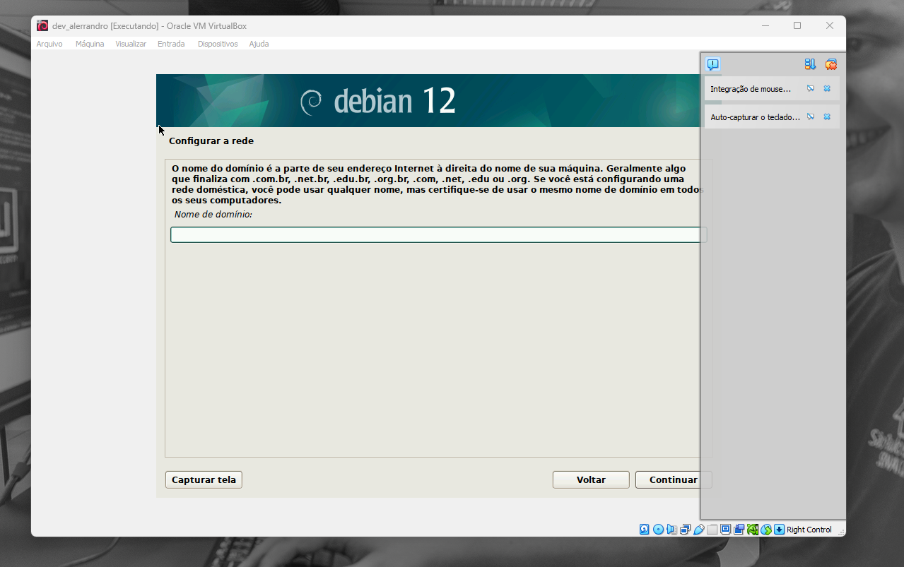

## foto 15

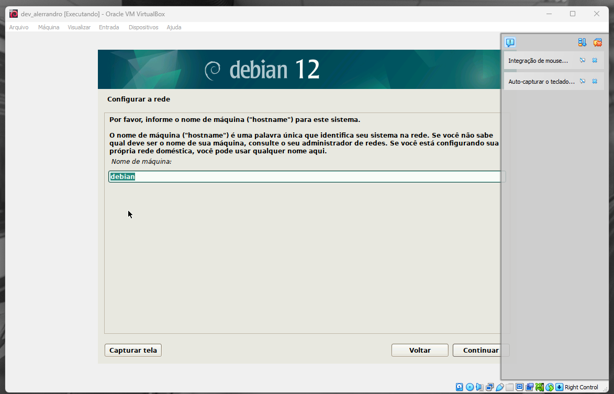

## foto 16

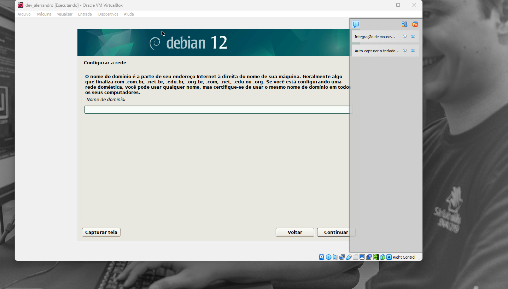

## foto 17

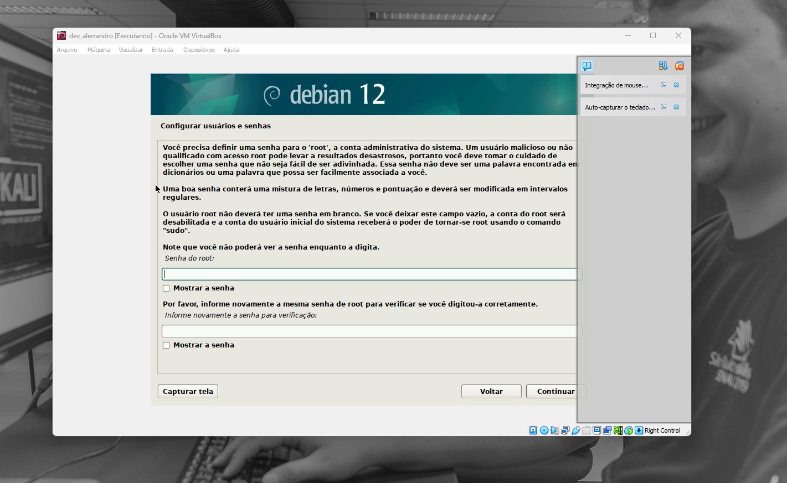